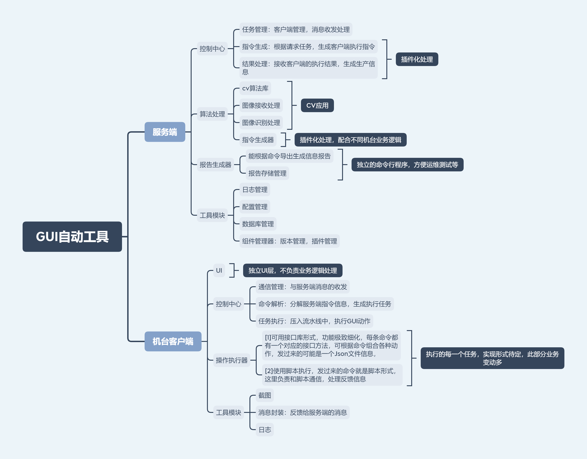

# GUI自动测试工具优化重构设计文档

# 1. 引言
- 1.1 背景
- 1.2 目的
- 1.3 范围
- 1.4 参考资料

# 2. 现有系统概述
- 2.1 系统架构
- 2.2 主要功能
- 2.3 技术栈
- 2.4 当前存在的问题

# 3. 优化目标
## 3.1 可维护性改进 

### 1. 代码规范和风格

- **一致的命名规则**：变量、函数、类等的命名应该清晰且具描述性，遵循一致的命名规则。
- **避免直接使用常量**：代码中有关直接做常量使用的数字、字符串等，应该用枚举项或者宏定义或者配置来定义。
- **注释规范**：编写清晰的注释，解释代码的目的和逻辑，尤其是复杂的算法和业务逻辑。

### 2. 代码结构

- **模块化**：将代码分解成独立的模块，每个模块负责单一的功能。模块之间通过明确的接口进行通信。
- **高内聚低耦合**：确保每个模块内部高度内聚，模块之间低耦合。减少模块间的依赖关系，提高代码的可复用性和可测试性。
- **分层架构**：采用分层架构，将业务逻辑、数据访问和用户界面分离，提高代码的组织性和可维护性。

### 3. 代码复用

- **函数和类的重用**：编写通用的函数和类，避免重复代码。使用继承和组合来复用代码。
- **库和框架**：使用成熟的第三方库和框架，减少重复造轮子的工作。

### 4. 代码文档

- **设计文档**：编写系统设计文档，说明整体架构和各模块的设计思路。
- **开发指南**：编写开发指南，介绍项目的开发环境、依赖管理和编码规范等。

### 6. 代码审查

- **代码审查**：定期进行代码审查，确保代码质量符合规范，及时发现和修复潜在的问题。

### 7. 版本控制

- **Git**：使用版本控制系统（如Git）管理代码，记录每一次修改的历史。
- **分支管理**：合理使用分支管理，如特性分支、开发分支和主分支，确保代码的稳定性和可追溯性。

> 因为公司内网安全管理以及异地办公等原因，不能做到每日同步代码到服务器，但是建议定期上传代码到团队服务器中，以此可做定期的代码审查工作，保证项目质量。

### 8. 错误处理

- **异常处理**：编写健壮的异常处理机制，确保程序在遇到错误时能够优雅地处理。
- **日志记录**：记录详细的日志信息，帮助调试和问题定位。
- **统一的错误码**：一致的错误码利于所有业务线代码的服用以及bug修复工作。


## 3.2 功能扩展

### 3.1 新增需求

+ 开发一组接口库，利于扩展性、复用性、维护性，避免大家互相造轮子。
+ 使用配置文件或者脚本来规划机台动作，避免频繁的编码编译过程，极大的加快开发效率。

### 3.2插件机制

+ 灵活适配不同业务场景，分离框架代码和具体场景业务代码，分工更明确，开发效率更高。


# 4. 优化方案

```bash
+-----------------+          +-----------------+
|      客户端      |          |     服务端      |
|  (执行GUI操作)   |          | (图像识别与指令)|
+-----------------+          +-----------------+
       |                             |
       |  请求命令和图片              |
       |----------------------------->
       |                             |
       |  下发执行指令               |
       |<-----------------------------
       |                             |
       |  上报测试结果               |
       |----------------------------->
       |                             |
+-----------------+          +-----------------+
```


# 5. 技术选型

- 框架与库
  - 5.2.1 服务器端
    - 编程语言可继续使用C++，现在多条业务线代码最高使用到C++17。最高使用C++17。
    - 服务端可去除界面，做后台服务进程使用，可放入托盘便于操作管理。
  - 5.2.2 客户端
    - 客户端可继续使用Java5
    - 客户端可使用Python，因为Python有不少商业友好的GUI自动工具，且python也能跨平台界面开发。
- 数据库
  - mysql
  - sqlite
- 其他工具
  - Json/C++: [nlohmann](https://github.com/nlohmann)
  - Log/C++:[log4cpp](https://github.com/orocos-toolchain/log4cpp)
  - net/C++:WinSocket

# 6. 详细设计
- 6.1 系统架构图
- 6.2 服务器端设计
  - 6.2.1 控制中心
  - 6.2.2 图像处理器
  - 6.2.3 报告生成器
- 6.3 客户端设计
  - 6.3.1 操作执行器
  - 6.3.2 屏幕截图
  - 6.3.3 通信模块
- 6.4 数据库设计
  - 6.4.1 表结构
  - 6.4.2 数据关系
- 6.5 消息队列设计
  - 6.5.1 消息类型
  - 6.5.2 消息处理流程

# 7. 实施计划
- 7.1 项目阶段划分
- 7.2 任务分配
- 7.3 时间表
- 7.4 风险管理

# 8. 测试策略
- 8.1 单元测试
- 8.2 集成测试
- 8.3 系统测试
- 8.4 性能测试
- 8.5 回归测试

# 9. 维护计划
- 9.1 日常维护
- 9.2 版本更新
- 9.3 故障排除
- 9.4 文档更新

# 10. 附录
- 10.1 术语表
- 10.2 代码样例
- 10.3 测试用例
- 10.4 配置文件示例

### 11. 参考文献

### 12. 修订历史

---

这个目录大纲涵盖了从引言到附录的各个方面，确保文档内容全面、详细，能够指导整个优化重构项目的实施。希望这对你有所帮助！如果有任何特定部分需要进一步展开，请告诉我。